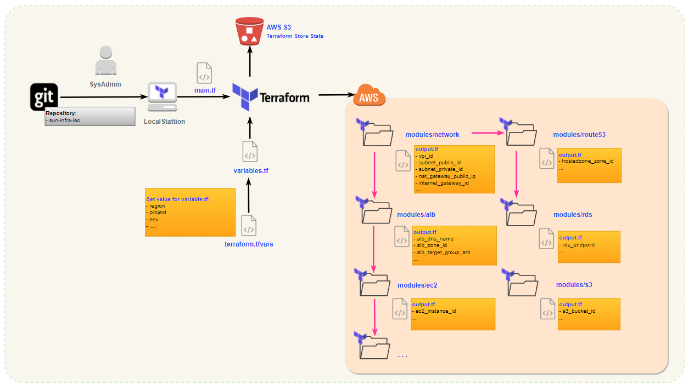

# with Terraform



## Install

Refer how to install [terraform](https://learn.hashicorp.com/tutorials/terraform/install-cli) base on your OS.

## Environments

- [ ] DEV
- [ ] STG
- [x] PROD

## Services

- [x] Admin
- [x] General

### Vars

- Create variables for main.tf
  - [x] variables.tf
- Values of variables for each environment
  - [x] terraform.tfvars

### Backend

- Backends primarily determine where Terraform stores its state. Terraform uses this persisted state data to keep track of the resources it manages. Since it needs the state in order to know which real-world infrastructure objects correspond to the resources in a configuration, everyone working with a given collection of infrastructure resources must be able to access the same state data.

### Outputs

- Output values make information about your infrastructure available on the command line, and can expose information for other Terraform configurations to use. Output values are similar to return values in programming languages.

## Terraform init

- Initialize a working directory containing Terraform configuration files. This is the first command that should be run after writing a new Terraform configuration or cloning an existing one from version control. It is safe to run this command multiple times.

```bash
make init
```

## Terraform apply/destroy

- convenient way to action to remote objects managed by a particular Terraform configuration.

```bash
#Plan/Deploy all resources
make plan
make apply

#Destroy all resources
make plan_destroy
make destroy
```
