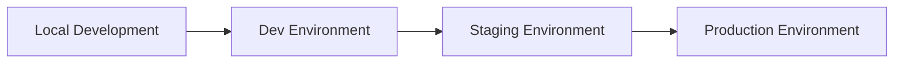

# 🚀 Hướng dẫn Terraform AWS từ A-Z cho người mới bắt đầu

> **Tài liệu hướng dẫn chi tiết từ cơ bản đến nâng cao** để triển khai Infrastructure as Code với Terraform trên AWS

<br>

## 📋 Mục lục

| **Phần** | **Nội dung** | **Độ khó** |
|----------|--------------|------------|
| **1.** | [📝 Giới thiệu về Terraform và AWS](#1-📝-giới-thiệu-về-terraform-và-aws) | ⭐ |
| **2.** | [🔧 Cài đặt và chuẩn bị môi trường](#2-🔧-cài-đặt-và-chuẩn-bị-môi-trường) | ⭐ |
| **3.** | [🔐 Thiết lập AWS và cấu hình credentials](#3-🔐-thiết-lập-aws-và-cấu-hình-credentials) | ⭐⭐ |
| **4.** | [📁 Cấu trúc project](#4-📁-cấu-trúc-project) | ⭐⭐ |
| **5.** | [🗄️ Khởi tạo backend và state management](#5-🗄️-khởi-tạo-backend-và-state-management) | ⭐⭐ |
| **6.** | [🚀 Triển khai infrastructure đầu tiên](#6-🚀-triển-khai-infrastructure-đầu-tiên) | ⭐⭐ |
| **7.** | [🌍 Quản lý các environment](#7-🌍-quản-lý-các-environment) | ⭐⭐⭐ |
| **8.** | [📦 Sử dụng modules có sẵn](#8-📦-sử-dụng-modules-có-sẵn) | ⭐⭐⭐ |
| **9.** | [🔧 Tự viết modules riêng](#9-🔧-tự-viết-modules-riêng) | ⭐⭐⭐⭐ |
| **10.** | [🔧 Advanced: CI/CD với terraform-dependencies](#10-🔧-advanced-cicd-với-terraform-dependencies) | ⭐⭐⭐⭐ |
| **11.** | [⭐ Best practices và troubleshooting](#11-⭐-best-practices-và-troubleshooting) | ⭐⭐⭐ |
| **12.** | [💻 Các lệnh thường dùng](#12-💻-các-lệnh-thường-dùng) | ⭐⭐ |


---

<br>

# 1. 📝 Giới thiệu về Terraform và AWS

## 💡 Terraform là gì?

**Terraform** là một công cụ Infrastructure as Code (IaC) được phát triển bởi HashiCorp. Nó cho phép bạn:

| **Tính năng** | **Lợi ích** |
|---------------|-------------|
| 🔧 **Định nghĩa hạ tầng bằng code** | Thay vì tạo resources bằng tay trên AWS Console |
| 📝 **Version control** | Quản lý phiên bản hạ tầng như quản lý source code |
| 🤖 **Automation** | Tự động hóa việc tạo, cập nhật, và xóa resources |
| ✅ **Consistency** | Đảm bảo tính nhất quán giữa các environments |

<br>

## 🎯 Tại sao sử dụng Terraform với AWS?

- **🚀 Scalability**: Dễ dàng mở rộng hạ tầng
- **💰 Cost Management**: Kiểm soát chi phí tốt hơn  
- **👥 Collaboration**: Nhiều người có thể làm việc cùng nhau
- **🔄 Disaster Recovery**: Khôi phục hạ tầng nhanh chóng

<br>

## 📚 Các khái niệm cơ bản

| **Khái niệm** | **Giải thích** | **Ví dụ** |
|---------------|----------------|-----------|
| **Resource** | Các thành phần hạ tầng | EC2, VPC, S3, RDS |
| **Provider** | Kết nối với cloud provider | AWS, Azure, GCP |
| **State** | Trạng thái hiện tại của hạ tầng | File `.tfstate` |
| **Module** | Tập hợp resources có thể tái sử dụng | VPC module, EC2 module |

---

<br>

# 2. 🔧 Cài đặt và chuẩn bị môi trường

## ⚙️ Cài đặt các công cụ cần thiết

### 🔄 Git - Quản lý source code

```bash
# Ubuntu/Debian
sudo apt update && sudo apt install -y git

# MacOS
brew install git

# Kiểm tra cài đặt
git --version
```

<br>

### 🏗️ Terraform - Công cụ chính

```bash
# Ubuntu/Debian
sudo apt-get update && sudo apt-get install -y gnupg software-properties-common
wget -O- https://apt.releases.hashicorp.com/gpg | gpg --dearmor | sudo tee /usr/share/keyrings/hashicorp-archive-keyring.gpg
echo "deb [signed-by=/usr/share/keyrings/hashicorp-archive-keyring.gpg] https://apt.releases.hashicorp.com $(lsb_release -cs) main" | sudo tee /etc/apt/sources.list.d/hashicorp.list
sudo apt update && sudo apt install terraform

# MacOS
brew install terraform

# Kiểm tra cài đặt
terraform --version
```

<br>

### ☁️ AWS CLI - Tương tác với AWS

```bash
# Ubuntu/Debian
sudo apt install -y awscli

# MacOS
brew install awscli

# Kiểm tra cài đặt
aws --version
```

<br>

### 🛠️ Make - Automation với Makefile

```bash
# Ubuntu/Debian
sudo apt install -y make

# MacOS
brew install make

# Kiểm tra cài đặt
make --version
```

<br>

## 📂 Clone repository

```bash
# Tạo thư mục làm việc
mkdir ~/terraform-projects
cd ~/terraform-projects

# Clone repository
git clone git@github.com:sun-asterisk-internal/sun-infra-iac.git
cd sun-infra-iac

# Đổi tên project theo dự án của bạn
mv sun-infra-iac my-awesome-project
cd my-awesome-project

# Tập trung vào AWS
# 1. Mở File Manager/Explorer
# 2. Copy thư mục "examples/aws" ra ngoài thành thư mục "aws"
# 3. Xóa thư mục "examples" (không cần nữa)
```

<br>

## 📝 Cách tạo/chỉnh sửa file

Trong hướng dẫn này, chúng ta sẽ cần tạo và chỉnh sửa nhiều file. Bạn có thể sử dụng các text editor sau:

| **Editor** | **Platform** | **Cách mở** |
|------------|--------------|-------------|
| **VS Code** | All | Mở VS Code → Open Folder → Chọn thư mục project |
| **Notepad++** | Windows | Tạo file mới, copy nội dung, Save As |
| **TextEdit** | MacOS | Applications → TextEdit |
| **Gedit** | Linux | `gedit filename` |

---

<br>

# 3. 🔐 Thiết lập AWS và cấu hình credentials

## 👤 Tạo AWS Account và IAM User

### Bước 1️⃣: Tạo AWS Account (Optional)

> **Lưu ý**: Nếu bạn đã có AWS Account, có thể bỏ qua bước này và chuyển thẳng đến Bước 2.

1. Truy cập [aws.amazon.com](https://aws.amazon.com)
2. Đăng ký tài khoản mới  
3. Xác thực thông tin thanh toán

<br>

### Bước 2️⃣: Tạo IAM User cho Terraform

| **Bước** | **Thao tác** | **Giá trị** |
|----------|--------------|-------------|
| 1 | Đăng nhập AWS Console → Tìm "IAM" | |
| 2 | Users → Add user | |
| 3 | Username | `terraform-user` |
| 4 | Access type | ✅ Programmatic access |
| 5 | Permissions | ✅ `AdministratorAccess` |
| 6 | Review → Create user | |
| 7 | **⚠️ LƯU LẠI** | Access Key ID + Secret Access Key |

<br>

> ### 🚨 CẢNH BÁO BẢO MẬT
> 
> - **KHÔNG BAO GIỜ** chia sẻ hoặc để lộ Access Key ID và Secret Access Key
> - Những thông tin này có quyền **AdministratorAccess** - có thể tạo/xóa tất cả resources AWS  
> - Nếu bị lộ, kẻ xấu có thể tạo resources tốn kém → **phát sinh chi phí cao**
> - Lưu trữ an toàn, không commit vào Git, không gửi qua chat/email
> - Nếu nghi ngờ bị lộ → **Vô hiệu hóa ngay lập tức** trong AWS Console

<br>

### Bước 3️⃣: Thiết lập MFA (Recommended)

1. Trong IAM User vừa tạo → **Security credentials**
2. **Multi-factor authentication** → **Assign MFA device**  
3. Chọn **Virtual MFA device**
4. Sử dụng app Google Authenticator hoặc Authy
5. Lưu lại **MFA device name** (thường là `username`)

<br>

## ⚙️ Cấu hình AWS CLI

### 🔹 Nếu KHÔNG sử dụng MFA:

```bash
aws configure --profile myproject-dev
```

**Nhập thông tin khi được hỏi:**
- **AWS Access Key ID**: (từ Bước 2)
- **AWS Secret Access Key**: (từ Bước 2)  
- **Default region**: `ap-northeast-1`
- **Default output format**: `json`

<br>

### 🔹 Nếu SỬ DỤNG MFA:

#### Bước 1: Tạo profile chính

```bash
aws configure --profile myproject-default
```

**Nhập thông tin:**
- **AWS Access Key ID**: (từ Bước 2)
- **AWS Secret Access Key**: (từ Bước 2)
- **Default region**: `ap-northeast-1`  
- **Default output format**: `json`

<br>

#### Bước 2: Tạo profile tạm thời cho Terraform

**Tạo/chỉnh sửa file `~/.aws/credentials`:**

| **Platform** | **Đường dẫn** |
|--------------|---------------|
| Linux/Mac | `/home/username/.aws/credentials` |
| Windows | `C:\Users\username\.aws\credentials` |

**Thêm nội dung sau vào cuối file:**

```ini
[myproject-dev]
aws_access_key_id = 
aws_secret_access_key = 
aws_session_token = 
```

<br>

#### Bước 3: Tạo config cho profile

**Tạo/chỉnh sửa file `~/.aws/config`:**

```ini
[profile myproject-dev]
output = json
region = ap-northeast-1
```

<br>

## 🔑 Sử dụng script tạo temporary credentials (với MFA)

```bash
cd aws
chmod +x create-aws-sts.sh

# Chạy script
./create-aws-sts.sh myproject-default myproject-dev <account-id> <iam-username> <mfa-token>
```

**Giải thích tham số:**

| **Tham số** | **Giải thích** | **Ví dụ** |
|-------------|----------------|-----------|
| `myproject-default` | Profile chính có MFA | (từ Bước 1) |
| `myproject-dev` | Profile tạm thời cho Terraform | (từ Bước 2) |
| `<account-id>` | AWS Account ID (12 chữ số) | Tìm trong AWS Console → IAM |
| `<iam-username>` | Tên IAM user | `terraform-user` |
| `<mfa-token>` | Mã 6 số từ MFA app | `123456` |

> **📝 Lưu ý:** Script này cần chạy mỗi khi session token hết hạn (thường là 12 giờ).

---

<br>

# 4. 📁 Cấu trúc project

## 🏗️ Cấu trúc tổng quát

```
aws/
├── Makefile                    # Automation commands
├── pre-build.sh               # Script tạo backend resources  
├── create-aws-sts.sh          # Script tạo MFA credentials
├── terraform/
│   ├── envs/                  # Các environments
│   │   ├── dev/               # Development environment
│   │   ├── stg/               # Staging environment
│   │   └── prod/              # Production environment
│   └── README.md
└── terraform-dependencies/    # Scripts và configs hỗ trợ
    ├── codebuild/
    ├── codedeploy/
    └── lambda-function/
```

<br>

## 📦 Giải thích folder terraform-dependencies

> **Chứa các template files và scripts hỗ trợ cho các dịch vụ AWS CI/CD**

```
terraform-dependencies/
├── codebuild/
│   └── buildspec.yml          # Template cho AWS CodeBuild
├── codedeploy/  
│   ├── appspec.yml           # Template cho AWS CodeDeploy
│   └── hooks/                # Scripts chạy trong các phases
│       ├── 1.pull-and-config.sh
│       ├── 2.build-and-deploy.sh  
│       ├── 3.start.sh
│       └── 4.validate.sh
└── lambda-function/          # Template code cho AWS Lambda
```

**🎯 Tác dụng của các file:**

| **File/Folder** | **Tác dụng** | **Sử dụng khi nào** |
|-----------------|-------------|---------------------|
| `codebuild/buildspec.yml` | **Template** định nghĩa các bước build | Tạo CodeBuild project cho CI/CD |
| `codedeploy/appspec.yml` | **Template** định nghĩa cách deploy app | Tạo CodeDeploy application |
| `codedeploy/hooks/` | **Scripts** chạy trong từng phase deploy | Tùy chỉnh logic deploy |

**💡 Cách sử dụng:**
1. **Copy templates**: Khi tạo CI/CD pipeline, copy các file này vào project application  
2. **Customize**: Chỉnh sửa nội dung phù hợp với ứng dụng cụ thể
3. **Reference in Terraform**: Sử dụng trong terraform modules để tạo CodeBuild/CodeDeploy

<br>

## 🌍 Cấu trúc environment

```
terraform/envs/dev/
├── _variables.tf              # Biến dùng chung
├── terraform.dev.tfvars       # Giá trị biến cho dev  
├── 1.general/                 # Services cơ bản (VPC, IAM...)
├── 2.admin/                   # Admin services
├── 3.database/                # Database services  
├── 4.deployment/              # CI/CD services
└── 5.monitoring/              # Monitoring services
```

**🗂️ Phân loại các folder:**

| **Folder** | **Mục đích** | **Ví dụ services** |
|------------|-------------|-------------------|
| **1.general/** | Cơ sở hạ tầng chung | VPC, IAM, S3, KMS, Route53 |
| **2.admin/** | Quản trị hệ thống | IAM users, admin policies, backup configs |
| **3.database/** | Cơ sở dữ liệu | RDS, DynamoDB, ElastiCache, DocumentDB |
| **4.deployment/** | CI/CD Pipeline | CodePipeline, CodeBuild, CodeDeploy, ECR |
| **5.monitoring/** | Giám sát & Alerting | CloudWatch, EventBridge, SNS, CloudTrail |

<br>

## � Giải thích các file quan trọng

### 🔧 Cấu trúc service folder

```
1.general/
├── _backend.tf            # Cấu hình backend + kết nối AWS
├── _data.tf               # LẤY thông tin có sẵn từ AWS  
├── _outputs.tf            # XUẤT thông tin cho services khác
├── _variables.tf          # Symlink đến ../_variables.tf
├── vpc.tf                 # TẠO VPC và network resources
├── iam.tf                 # TẠO IAM roles và permissions
└── <service>.tf           # TẠO thêm dịch vụ khác
```

**💡 Phân loại file:**

| **File** | **Mục đích** | **Ví dụ** |
|----------|-------------|-----------|
| `_backend.tf` | Cấu hình lưu trữ state + kết nối AWS | Backend S3, AWS provider |
| `_data.tf` | **LẤY** thông tin có sẵn từ AWS | Danh sách AZ, AMI mới nhất |
| `_outputs.tf` | **XUẤT** thông tin cho services khác | VPC ID, Subnet IDs |
| `vpc.tf` | **TẠO** VPC và network resources | VPC, subnets, internet gateway |
| `iam.tf` | **TẠO** IAM roles và permissions | Roles cho EC2, Lambda |

<br>

## 📝 Các file cấu hình chi tiết

### 🔹 _variables.tf - Định nghĩa biến

```hcl
variable "project" {
  description = "Name of project"
  type        = string
}

variable "env" {
  description = "Environment (dev/stg/prod)"  
  type        = string
}

variable "region" {
  description = "AWS region"
  type        = string
}
```

<br>

### 🔹 terraform.dev.tfvars - Giá trị biến

```hcl
project = "my-awesome-project"
env     = "dev"
region  = "ap-northeast-1"
```

<br>

### 🔹 _backend.tf - Cấu hình lưu trữ state

```hcl
terraform {
  required_version = ">= 1.3.9"
  required_providers {
    aws = {
      source  = "hashicorp/aws"
      version = ">= 4.0"
    }
  }
  backend "s3" {
    profile        = "myproject-dev"                    # ← Từ mục 3: AWS CLI profile
    bucket         = "myproject-dev-iac-state"          # ← Từ mục 5: Tên S3 bucket
    key            = "1.general/terraform.dev.tfstate"  # ← Đường dẫn file state
    region         = "ap-northeast-1"                   # ← Region triển khai
    encrypt        = true                               # ← Luôn bật encryption
    kms_key_id     = "arn:aws:kms:ap-northeast-1:123456789012:key/abc-def-ghi"  # ← KMS Key ARN
    dynamodb_table = "myproject-dev-terraform-state-lock"  # ← DynamoDB table
  }
}

provider "aws" {
  region  = var.region                    # ← Sử dụng biến từ tfvars
  profile = "${var.project}-${var.env}"   # ← Tự động tạo profile name
  default_tags {
    tags = {
      Project     = var.project          # ← Tag tự động cho tất cả resources
      Environment = var.env              # ← Tag môi trường
    }
  }
}
```

**💡 Các thông tin cần thay đổi:**

| **Tham số** | **Lấy từ đâu** | **Ví dụ** |
|-------------|---------------|-----------|
| `profile` | Mục 3 - AWS CLI profile | `myproject-dev` |
| `bucket` | Mục 5 - Script pre-build.sh | `myproject-dev-iac-state` |
| `region` | Mục 3 - Region đã chọn | `ap-northeast-1` |
| `kms_key_id` | Mục 5 - Output của script | `arn:aws:kms:...` |
| `dynamodb_table` | Mục 5 - Script tự tạo | `myproject-dev-terraform-state-lock` |

---

<br>

# 5. 🗄️ Khởi tạo backend và state management

## 🤔 Backend là gì và tại sao cần?

### 📊 Terraform State

> **Terraform State** = File chứa thông tin về tất cả resources đã tạo (như danh sách tài sản)

**🚨 Vấn đề lưu ở máy local:**
- ❌ Chỉ mình bạn quản lý được
- ❌ Mất file = mất khả năng quản lý infrastructure  
- ❌ Không thể teamwork
- ❌ Không có backup

**✅ Giải pháp Remote Backend (AWS S3):**
- ✅ Team cùng làm việc được
- ✅ Tự động backup
- ✅ Tránh conflict khi nhiều người chạy cùng lúc
- ✅ Bảo mật với encryption

<br>

### 🏗️ Cần 3 thành phần chính

| **Component** | **Tác dụng** | **AWS Service** |
|---------------|-------------|-----------------|
| **🗄️ State Storage** | Lưu state file | S3 Bucket |
| **🔒 State Locking** | Khóa khi có người đang chạy | DynamoDB Table |
| **🔐 Encryption** | Mã hóa state file | KMS Key |

<br>

## 🚀 Tạo backend tự động với script

```bash
cd aws
chmod +x pre-build.sh
./pre-build.sh
```

**Script sẽ yêu cầu nhập 3 thông tin:**

| **Thông tin** | **Ví dụ** | **Mô tả** |
|---------------|-----------|-----------|
| **Project Name** | `myproject` | Tên dự án của bạn |
| **ENV** | `dev` | Môi trường (dev/stg/prod) |
| **Region** | `ap-northeast-1` | Region AWS triển khai |

> **💡 Lưu ý:** Thay đổi các giá trị này phù hợp với dự án của bạn

<br>

### 📦 Resources được tạo tự động

Script sẽ tự động tạo 3 resources AWS:

| **Resource** | **Tên sẽ được tạo** | **Tác dụng** |
|--------------|-------------------|-------------|
| **S3 Bucket** | `myproject-dev-iac-state` | Lưu trữ state files |
| **DynamoDB Table** | `myproject-dev-terraform-state-lock` | State locking |
| **KMS Key** | `alias/myproject-dev-iac` | Encryption |

> **❗ Quan trọng:** Script sẽ hiển thị **KMS Key ARN** ở cuối → **Copy ARN này** để dùng ở bước tiếp theo

<br>

## ⚙️ Cập nhật backend configuration

Sau khi chạy script, copy **KMS Key ARN** và cập nhật vào `_backend.tf`:

```hcl
terraform {
  backend "s3" {
    profile        = "myproject-dev"
    bucket         = "myproject-dev-iac-state"  
    key            = "1.general/terraform.dev.tfstate"
    region         = "ap-northeast-1"
    encrypt        = true
    kms_key_id     = "arn:aws:kms:ap-northeast-1:123456789012:key/abc-def-ghi"  # ← Paste KMS ARN ở đây
    dynamodb_table = "myproject-dev-terraform-state-lock"
  }
}
```

**🔧 Thay đổi các giá trị:**
1. `myproject` → Tên project thực tế của bạn
2. `dev` → Environment của bạn  
3. `ap-northeast-1` → Region của bạn
4. `kms_key_id` → KMS ARN từ output script

---

<br>

# 6. 🚀 Triển khai infrastructure đầu tiên

## 🛠️ Chuẩn bị môi trường dev

### Bước 1️⃣: Cập nhật variables

**Tạo file `terraform/envs/dev/terraform.dev.tfvars`:**

```hcl
project = "myproject"          # ← Đổi thành tên project của bạn
env     = "dev"
region  = "ap-northeast-1"
```

<br>

### Bước 2️⃣: Tạo symlinks cho variables

```bash
cd aws
make symlink e=dev s=general
```

> **💡 Symlink là gì?**
> 
> Symlink (symbolic link) là "đường dẫn tắt" trỏ đến file khác, giống shortcut trên desktop.
> 
> **Tại sao cần?**
> - File `_variables.tf` ở `envs/dev/` chứa tất cả biến cho environment `dev`
> - Mỗi service (`1.general`, `2.database`...) cần dùng chung file này  
> - Thay vì copy file → tạo symlink để tất cả services "nhìn" vào cùng 1 file gốc
> - Khi thay đổi biến → tất cả services đều cập nhật tự động

<br>

## 🏗️ Triển khai VPC đầu tiên

### Bước 1️⃣: Kiểm tra VPC configuration

```bash
# Xem nội dung file VPC
cat terraform/envs/dev/1.general/vpc.tf
```

<br>

### Bước 2️⃣: Initialize Terraform

```bash
make init e=dev s=general
```

**Lệnh này sẽ:**
- ⬇️ Download AWS provider
- 🔗 Khởi tạo backend S3  
- 📄 Tạo state file

<br>

### Bước 3️⃣: Plan - Xem preview

```bash
make plan e=dev s=general
```

**Terraform sẽ hiển thị:**

| **Ký hiệu** | **Ý nghĩa** | **Ví dụ** |
|-------------|-------------|-----------|
| **`+`** | Resources sẽ được **tạo** | `+ aws_vpc.main` |
| **`~`** | Resources sẽ được **cập nhật** | `~ aws_instance.web` |
| **`-`** | Resources sẽ được **xóa** | `- aws_s3_bucket.old` |

<br>

### Bước 4️⃣: Apply - Triển khai thực sự

```bash
make apply e=dev s=general
```

1. **Xem kết quả plan** một lần nữa
2. **Nhập `yes`** để xác nhận triển khai
3. **Chờ Terraform tạo resources** theo đúng kế hoạch

> **⏱️ Thời gian:** Thường mất 2-5 phút để tạo VPC và các resources liên quan

<br>

## ✅ Kiểm tra kết quả

### 🖥️ Trên AWS Console

**Kiểm tra các resources đã được tạo:**

| **Service** | **Tìm ở đâu** | **Tên resource** |
|-------------|---------------|------------------|
| **VPC** | VPC Dashboard | `myproject-dev-vpc` |
| **Subnets** | VPC → Subnets | Public & Private subnets |
| **Internet Gateway** | VPC → Internet Gateways | `myproject-dev-igw` |
| **NAT Gateway** | VPC → NAT Gateways | `myproject-dev-nat-*` |

<br>

### 💻 Bằng Terraform commands

```bash
# Xem danh sách tất cả resources
make state_list e=dev s=general

# Xem chi tiết VPC
make state_show e=dev s=general t='module.vpc.aws_vpc.vpc'

# Xem outputs
terraform output -state=terraform/envs/dev/1.general/terraform.tfstate
```

<br>

## 🎯 Kết quả mong đợi

Sau khi triển khai thành công, bạn sẽ có:

```
AWS Resources được tạo:
├── VPC (myproject-dev-vpc)
├── Public Subnets (2 AZ)  
├── Private Subnets (2 AZ)
├── Internet Gateway
├── NAT Gateways (2 AZ)
├── Route Tables
└── Security Groups (default)
```

**🎉 Chúc mừng!** Bạn đã triển khai thành công infrastructure đầu tiên với Terraform!

---

<br>

# 7. 🌍 Quản lý các environment

## 🎯 Tổng quan về multi-environment

> **Multi-environment** cho phép bạn có các môi trường riêng biệt với cấu hình khác nhau

| **Environment** | **Mục đích** | **Cấu hình** |
|-----------------|--------------|-------------|
| **🧪 Development (dev)** | Phát triển và testing | Instance size nhỏ, ít resources |
| **🚧 Staging (stg)** | UAT và pre-production | Giống production nhưng nhỏ hơn |  
| **🚀 Production (prod)** | Live system | High availability, scalable |

<br>

## 🔄 Tạo environment staging

> **Các bước tương tự như dev environment, chỉ thay `dev` → `stg`**

<details>
<summary><strong>📋 Chi tiết các bước tạo Staging environment</strong></summary>

<br>

### Bước 1️⃣: Copy structure từ dev

```bash
# Copy thư mục dev thành stg
cp -r terraform/envs/dev terraform/envs/stg
```

<br>

### Bước 2️⃣: Cập nhật configs cho staging

**Sửa file `terraform/envs/stg/terraform.stg.tfvars`:**

```hcl
project = "myproject"
env     = "stg"              # ← Thay đổi từ "dev" thành "stg"
region  = "ap-northeast-1"
```

<br>

### Bước 3️⃣: Cập nhật backend cho staging

**Sửa file `terraform/envs/stg/1.general/_backend.tf`:**

```hcl
terraform {
  backend "s3" {
    profile        = "myproject-stg"                      # ← Đổi profile
    bucket         = "myproject-stg-iac-state"           # ← Đổi bucket  
    key            = "1.general/terraform.stg.tfstate"   # ← Đổi key
    region         = "ap-northeast-1"
    encrypt        = true
    kms_key_id     = "arn:aws:kms:..."                   # ← KMS key cho stg
    dynamodb_table = "myproject-stg-terraform-state-lock" # ← DynamoDB cho stg
  }
}
```

<br>

### Bước 4️⃣: Tạo backend resources cho staging

```bash
./pre-build.sh
# Nhập: myproject, stg, ap-northeast-1
```

<br>

### Bước 5️⃣: Deploy staging

```bash
make symlink e=stg s=general
make init e=stg s=general  
make plan e=stg s=general
make apply e=stg s=general
```

</details>

<br>

## 🚀 Tạo environment production

<details>
<summary><strong>📋 Chi tiết các bước tạo Production environment</strong></summary>

<br>

### Các bước tương tự staging, chỉ thay `stg` → `prod`

```bash
# 1. Copy structure
cp -r terraform/envs/dev terraform/envs/prod

# 2. Cập nhật terraform.prod.tfvars
# env = "prod"

# 3. Cập nhật _backend.tf  
# profile = "myproject-prod"
# bucket = "myproject-prod-iac-state"
# key = "1.general/terraform.prod.tfstate"

# 4. Tạo backend resources
./pre-build.sh
# Nhập: myproject, prod, ap-northeast-1

# 5. Deploy
make symlink e=prod s=general
make init e=prod s=general
make plan e=prod s=general  
make apply e=prod s=general
```

</details>

<br>

## 📊 So sánh các environments

### 🔧 Differences trong cấu hình

| **Thành phần** | **Dev** | **Staging** | **Production** |
|---------------|---------|-------------|----------------|
| **EC2 Instance** | `t3.micro` | `t3.small` | `t3.medium+` |
| **RDS** | `db.t3.micro` | `db.t3.small` | Multi-AZ |
| **ALB** | 1 AZ | 2 AZ | 3 AZ |
| **Auto Scaling** | Min: 1, Max: 2 | Min: 1, Max: 3 | Min: 2, Max: 10 |

<br>

### 🎛️ Environment-specific variables

**Ví dụ trong `terraform.{env}.tfvars`:**

```hcl
# terraform.dev.tfvars
instance_type = "t3.micro"
min_size      = 1
max_size      = 2
enable_backup = false

# terraform.prod.tfvars  
instance_type = "t3.large"
min_size      = 2
max_size      = 10
enable_backup = true
```

<br>

## 🔄 Workflow quản lý environments

### 📋 Quy trình development



**Chi tiết workflow:**

| **Bước** | **Environment** | **Mục đích** |
|----------|----------------|-------------|
| 1 | **Local** | Viết code, test cơ bản |
| 2 | **Dev** | Deploy và test tính năng mới |
| 3 | **Staging** | UAT, integration testing |
| 4 | **Production** | Release cho end users |

<br>

### 🚀 Commands thường dùng

```bash
# Deploy lên dev
make apply e=dev s=general

# Deploy lên staging  
make apply e=stg s=general

# Deploy lên production
make apply e=prod s=general

# Xem sự khác biệt
make plan e=prod s=general
```

<br>

## ⚠️ Best practices

### ✅ Nên làm

- ✅ **Test trên dev trước** khi deploy lên staging/production
- ✅ **Backup state files** trước khi thay đổi lớn
- ✅ **Sử dụng different AWS accounts** cho prod vs dev/stg
- ✅ **Review plan carefully** trước khi apply
- ✅ **Tag resources** với environment name

### ❌ Không nên làm

- ❌ **Không test trực tiếp trên production**
- ❌ **Không dùng chung backend** giữa các environments  
- ❌ **Không commit sensitive data** vào git
- ❌ **Không skip planning step**

> **💡 Pro tip:** Sử dụng separate AWS accounts cho production và non-production environments để tăng security và cost control

#### Bước 2: Cập nhật configs cho production
1. Mở text editor
2. Mở file: `terraform/envs/prod/terraform.prod.tfvars`
3. Sửa nội dung thành:

```hcl
project = "myproject"
env     = "prod"  # ← Thay đổi env
region  = "ap-northeast-1"
```

#### Bước 3: Cập nhật backend cho production
1. Mở text editor
2. Mở file: `terraform/envs/prod/1.general/_backend.tf`
3. Sửa nội dung thành:

```hcl
terraform {
  backend "s3" {
    profile        = "myproject-prod"          # ← Đổi profile
    bucket         = "myproject-prod-iac-state" # ← Đổi bucket
    key            = "1.general/terraform.prod.tfstate" # ← Đổi key
    region         = "ap-northeast-1"
    encrypt        = true
    kms_key_id     = "arn:aws:kms:ap-northeast-1:123456789012:key/xyz-abc-def" # ← KMS key cho prod
    dynamodb_table = "myproject-prod-terraform-state-lock" # ← DynamoDB cho prod
  }
}
```

#### Bước 4: Tạo backend resources cho production
```bash
./pre-build.sh
# Nhập: myproject, prod, ap-northeast-1
```

#### Bước 5: Deploy production
```bash
make symlink e=prod s=general
make init e=prod s=general
make plan e=prod s=general
make apply e=prod s=general
```

</details>

**⚠️ Lưu ý cho Production:**
- Triển khai multi-region để tăng tính sẵn sàng (high availability)
- Cấu hình backup tự động
- Thiết lập monitoring và alerting
- Review kỹ lưỡng trước khi apply

---

## 8. 📦 Sử dụng modules có sẵn

### 8.1 Hiểu về Terraform Modules

**Module** là cách đóng gói và tái sử dụng code Terraform. Thay vì viết lại code, bạn dùng modules có sẵn.

**💡 Lợi ích của modules:**
- ✅ **Tái sử dụng**: Không phải viết lại code
- ✅ **Consistency**: Đảm bảo cấu hình nhất quán
- ✅ **Best practices**: Modules đã được optimize
- ✅ **Time saving**: Tiết kiệm thời gian development

### 8.2 Tìm và sử dụng modules

**💡 NOTE:** Sun Asterisk đã viết sẵn nhiều modules phổ biến, bạn có thể sử dụng luôn mà không cần viết lại từ đầu!

<details>
<summary>📋 <strong>Hướng dẫn chi tiết tìm và sử dụng modules</strong></summary>

#### **Bước 1: Truy cập Module Repository**
1. Mở link: https://github.com/sun-asterisk-internal/sun-infra-iac
2. Navigate đến thư mục modules để xem modules có sẵn

#### **Bước 2: Tìm Module Version phù hợp**
1. Click **Branches** → chọn **Tags**
2. Tìm theo pattern: `terraform-aws-<service>_v<version>`
3. Ví dụ: Muốn tạo S3 bucket → tìm `terraform-aws-s3`
4. Chọn version mới nhất
5. ⚠️ **Ghi nhớ tag version** để dùng trong config

📌 **Minh họa tìm module bằng tag:**  


#### **Bước 3: Xác định Module Path**
Modules được cấu trúc theo dạng:
```
modules/
└── aws/
    └── service_name/
```
Ví dụ với S3 module:
```
modules/
└── aws/
    └── s3/
```

📌 **Minh họa folder của module:**  


#### **Bước 4: Kiểm tra Required Variables**
1. Mở file `_variables.tf` trong thư mục module
2. Review các variables bắt buộc và tùy chọn
3. Xem thư mục `examples/` để hiểu cách sử dụng

#### **Bước 5: Sử dụng Module trong Code**
Format chuẩn:
```hcl
module "tên_module" {
  source = "git@github.com:sun-asterisk-internal/sun-infra-iac.git//modules/aws/<service>?ref=<tag>"
  
  # Variables của module
}
```

</details>

#### **Module Source Format:**
```
source = "git@github.com:sun-asterisk-internal/sun-infra-iac.git//[MODULE_PATH]?ref=[MODULE_TAG_VERSION]"
```

**Ví dụ source đúng format:**
```hcl
source = "git@github.com:sun-asterisk-internal/sun-infra-iac.git//modules/aws/s3?ref=terraform-aws-s3_v0.2.1"
```

### 8.3 Ví dụ thực tế sử dụng module để  tạo S3 bucket

Các bước tương tự như **VPC deployment** ở mục 6.2: **Tạo file config** → **Plan** → **Apply**.

<details>
<summary>📋 <strong>Chi tiết cách tạo S3 bucket</strong></summary>

#### Bước 1: Tạo file mới đặt tên là s3.tf

1. Mở VS Code hoặc text editor bất kỳ
2. Tạo file mới: `terraform/envs/dev/1.general/s3.tf`
3. Copy nội dung bên dưới vào file

**Nội dung file:**

```hcl
###################
# S3 bucket for storing logs
###################
module "s3_logs" {
  source = "git@github.com:sun-asterisk-internal/sun-infra-iac.git//modules/aws/s3?ref=terraform-aws-s3_v0.2.1"

  # Basic variables
  project = var.project
  env     = var.env

  # S3 specific configuration
  s3_bucket = {
    name = "${var.project}-${var.env}-logs"
  }
}

###################
# S3 bucket for static website
###################
module "s3_website" {
  source = "git@github.com:sun-asterisk-internal/sun-infra-iac.git//modules/aws/s3?ref=terraform-aws-s3_v0.2.1"

  project = var.project
  env     = var.env

  s3_bucket = {
    name = "${var.project}-${var.env}-website"
    
    # Enable static website hosting
    website = {
      index_document = "index.html"
      error_document = "error.html"
    }
  }
}
```

#### Bước 2: Thêm outputs

1. Mở file: `terraform/envs/dev/1.general/_outputs.tf`
2. Thêm nội dung bên dưới vào cuối file

**Nội dung thêm vào cuối file:**

```hcl
# Thêm vào cuối file
output "s3_logs_bucket_name" {
  value       = module.s3_logs.bucket_name
  description = "Name of S3 logs bucket"
}

output "s3_website_bucket_name" {
  value       = module.s3_website.bucket_name
  description = "Name of S3 website bucket"
}

output "s3_website_url" {
  value       = module.s3_website.website_endpoint
  description = "URL of S3 website"
}
```

#### Bước 3: Deploy
```bash
make plan e=dev s=general
make apply e=dev s=general
```

</details>

### 8.4 Sử dụng outputs từ service khác

Khi muốn sử dụng resources từ service khác (ví dụ: sử dụng VPC ID từ `1.general` trong `3.database`), bạn cần:

#### Bước 1: Tạo thư mục service mới
1. Tạo thư mục `terraform/envs/dev/3.database/`
2. Copy file `_backend.tf` từ `1.general` sang `3.database`

#### Bước 2: Cập nhật `_backend.tf` trong service mới
1. Mở file: `terraform/envs/dev/3.database/_backend.tf`
2. Thay đổi `key` trong backend config:

```hcl
terraform {
  backend "s3" {
    profile        = "myproject-dev"
    bucket         = "myproject-dev-iac-state"
    key            = "3.database/terraform.dev.tfstate"  # ← Thay đổi đường dẫn
    region         = "ap-northeast-1"
    encrypt        = true
    kms_key_id     = "arn:aws:kms:ap-northeast-1:123456789012:key/abc-def-ghi"
    dynamodb_table = "myproject-dev-terraform-state-lock"
  }
}

provider "aws" {
  region  = var.region
  profile = "${var.project}-${var.env}"
  default_tags {
    tags = {
      Project     = var.project
      Environment = var.env
    }
  }
}

# ← Thêm phần này vào cuối file _backend.tf
data "terraform_remote_state" "general" {
  backend = "s3"
  config = {
    profile = "${var.project}-${var.env}"
    bucket  = "${var.project}-${var.env}-iac-state"
    key     = "1.general/terraform.${var.env}.tfstate"  # ← Trỏ đến state của general
    region  = var.region
  }
}
```
Tương tự nếu muốn sử dụng resources từ service của `2.admin` trong `3.database` thì ta thêm đoạn data "terraform_remote_state" "admin" vào cuối file `_backend.tf`
```hcl

data "terraform_remote_state" "admin" {
  backend = "s3"
  config = {
    profile = "${var.project}-${var.env}"
    bucket  = "${var.project}-${var.env}-iac-state"
    key     = "2.admin/terraform.${var.env}.tfstate"  # ← Trỏ đến state của admin
    region  = var.region
  }
}
```

#### Bước 3: Tạo symlink cho variables
```bash
make symlink e=dev s=database  # ← Sử dụng tên service: database (không có số)
```

#### Bước 4: Sử dụng outputs trong file terraform
Tạo file `terraform/envs/dev/3.database/rds.tf`:

```hcl
module "database" {
  source = "git@github.com:sun-asterisk-internal/sun-infra-iac.git//modules/aws/rds?ref=terraform-aws-rds_v0.1.0"

  project = var.project
  env     = var.env

  # ← Sử dụng VPC ID từ service general
  vpc_id     = data.terraform_remote_state.general.outputs.vpc_id
  subnet_ids = data.terraform_remote_state.general.outputs.private_subnet_ids
}
```

#### Bước 5: Deploy service mới
```bash
make init e=dev s=database
make plan e=dev s=database
make apply e=dev s=database
```

**💡 Lưu ý quan trọng:**
- Phần `data "terraform_remote_state"` được khai báo trong file `_backend.tf`, không phải file `_data.tf` riêng
- Mỗi service sẽ có `key` khác nhau trong backend config để tránh conflict
- Phải deploy service `1.general` trước khi deploy `3.database`
- Template hiện có: `1.general`, `2.admin` → Tạo thêm `3.database`

### 8.5 Ví dụ về cách sử dụng _data.tf
File `_data.tf` được sử dụng để lấy thông tin về các tài nguyên có sẵn trên AWS mà không cần tạo mới.

**Ví dụ:** Lấy danh sách Availability Zones (AZs) trong region hiện tại.

1.  Mở file: `terraform/envs/dev/1.general/_data.tf`
2.  Thêm nội dung sau:

```hcl
# Lấy thông tin về tất cả Availability Zones có sẵn trong region hiện tại
data "aws_availability_zones" "available" {
  state = "available"
}
```

3.  Bây giờ, bạn có thể sử dụng danh sách AZs này trong các file khác, ví dụ trong `vpc.tf`:

```hcl
# ví dụ trong vpc.tf
resource "aws_subnet" "public" {
  count = 2 # Tạo 2 public subnets

  vpc_id            = aws_vpc.main.id
  availability_zone = data.aws_availability_zones.available.names[count.index]
  # ... các cấu hình khác
}
```

**💡 Lợi ích:** Code của bạn sẽ tự động hoạt động ở bất kỳ region nào mà không cần hardcode tên AZs (ví dụ: `ap-northeast-1a`, `ap-northeast-1c`).

### 8.6 Best Practices khi sử dụng modules

<details>
<summary>📋 <strong>Chi tiết Best Practices cho Module Usage</strong></summary>

#### **1. Version Control**
- ✅ **Luôn chỉ định module version** bằng tags
- ✅ **Sử dụng semantic versioning** (v0.1.0, v0.2.0, etc.)
- ✅ **Document module versions** trong code
- ❌ **Không dùng branch** thay vì tag

```hcl
# ✅ ĐÚNG - Sử dụng tag version
source = "git@github.com:sun-asterisk-internal/sun-infra-iac.git//modules/aws/s3?ref=terraform-aws-s3_v0.2.1"

# ❌ SAI - Không nên dùng branch
source = "git@github.com:sun-asterisk-internal/sun-infra-iac.git//modules/aws/s3?ref=main"
```

#### **2. Variable Management**
- ✅ **Naming convention nhất quán** giữa các modules
- ✅ **Document tất cả required variables**
- ✅ **Provide default values** cho optional variables
- ✅ **Validate inputs** khi có thể

#### **3. Module Organization**
- ✅ **Group related resources** trong cùng một module
- ✅ **Keep modules focused** trên specific services
- ✅ **Sử dụng clear và descriptive names**
- ✅ **Separate concerns** - một module một nhiệm vụ

#### **4. Testing & Validation**
- ✅ **Test modules trước khi dùng production**
- ✅ **Review module documentation**
- ✅ **Ensure compatibility** với environment hiện tại
- ✅ **Check for known issues** hoặc limitations

</details>

---

## 9. 🔧 Tự viết modules riêng

### 9.1 Khi nào nên tự viết modules?

**✅ Khi nên tạo modules riêng:**
- Không có modules có sẵn cho use case cụ thể của bạn
- Cần logic business tùy chỉnh
- Muốn kết hợp nhiều resources với cấu hình đặc biệt
- Cần thực thi các standards và policies của công ty

**❌ Khi không nên tạo modules:**
- Đã có modules tốt có sẵn
- Chỉ tạo 1-2 resources đơn giản
- Cấu hình chỉ sử dụng một lần

### 9.2 Tạo cấu trúc folder modules

**Bước 1: Tạo folder modules**
1. Mở File Manager/Explorer
2. Vào thư mục `terraform` của project
3. Tạo folder mới tên `modules`

**Bước 2: Tạo folder cho module CodeCommit**
1. Vào trong folder `modules` vừa tạo
2. Tạo folder mới tên `codecommit`
3. Vào trong folder `codecommit`

**Kết quả cấu trúc sẽ như sau:**
```
terraform/
├── envs/
│   ├── dev/
│   ├── stg/
│   └── prod/
└── modules/          # ← Folder mới tạo
    └── codecommit/   # ← Folder cho module CodeCommit
        └── (sẽ tạo các file ở bước tiếp theo)
```

### 9.3 Cấu trúc một module chuẩn

<details>
<summary>📋 <strong>Cấu trúc files và mục đích của từng file</strong></summary>

```
terraform/modules/codecommit/
├── main.tf              # Resources chính
├── variables.tf         # Input variables  
├── outputs.tf           # Output values
├── versions.tf          # Provider requirements
└── README.md           # Documentation
```

| 📁 File | 🎯 Mục đích | 📝 Nội dung chính |
|---------|-------------|-------------------|
| **main.tf** | Tạo AWS resources | CodeCommit repos, KMS keys, CloudWatch events |
| **variables.tf** | Định nghĩa inputs | project, env, repositories config |
| **outputs.tf** | Trả về thông tin | Repository ARNs, URLs, KMS key IDs |
| **versions.tf** | Provider requirements | Terraform & AWS provider versions |
| **README.md** | Documentation | Usage examples, requirements |

</details>

### 9.4 Ví dụ: Tạo module CodeCommit

<details>
<summary>📋 <strong>Code cho module CodeCommit (Click để xem)</strong></summary>

#### **🔧 Variables Definition**

**File: `terraform/modules/codecommit/variables.tf`**

```hcl
variable "project" {
  description = "Project name"
  type        = string
}

variable "env" {
  description = "Environment (dev/stg/prod)"
  type        = string
}

variable "repositories" {
  description = "Map of CodeCommit repositories to create"
  type = map(object({
    description           = string
    default_branch       = optional(string, "main")
    enable_notifications = optional(bool, false)
    tags                 = optional(map(string), {})
  }))
  default = {}
}

variable "enable_kms_encryption" {
  description = "Enable KMS encryption for repositories"
  type        = bool
  default     = true
}

variable "kms_key_id" {
  description = "KMS key ID for repository encryption (optional)"
  type        = string
  default     = null
}
```

#### **⚙️ Main Resources**

**File: `terraform/modules/codecommit/main.tf`**

```hcl
# KMS Key cho mã hóa
resource "aws_kms_key" "codecommit" {
  count = var.enable_kms_encryption && var.kms_key_id == null ? 1 : 0
  
  description             = "KMS key for ${var.project}-${var.env} CodeCommit repositories"
  deletion_window_in_days = 7
  enable_key_rotation     = true

  tags = {
    Name        = "${var.project}-${var.env}-codecommit-key"
    Project     = var.project
    Environment = var.env
    Service     = "codecommit"
  }
}

# KMS Alias
resource "aws_kms_alias" "codecommit" {
  count = var.enable_kms_encryption && var.kms_key_id == null ? 1 : 0
  
  name          = "alias/${var.project}-${var.env}-codecommit"
  target_key_id = aws_kms_key.codecommit[0].key_id
}

# CodeCommit Repositories
resource "aws_codecommit_repository" "repos" {
  for_each = var.repositories

  repository_name = "${var.project}-${var.env}-${each.key}"
  description     = each.value.description

  dynamic "repository_encryption" {
    for_each = var.enable_kms_encryption ? [1] : []
    content {
      encryption_type = "KMS"
      kms_key_id = var.kms_key_id != null ? var.kms_key_id : aws_kms_key.codecommit[0].arn
    }
  }

  tags = merge(
    {
      Name        = "${var.project}-${var.env}-${each.key}"
      Project     = var.project
      Environment = var.env
      Service     = "codecommit"
    },
    each.value.tags
  )
}
```

<details>
<summary>� <strong>Optional: CloudWatch Events & SNS Notifications</strong></summary>

```hcl
# CloudWatch Event Rule for notifications
resource "aws_cloudwatch_event_rule" "codecommit_events" {
  for_each = {
    for repo_name, repo_config in var.repositories : repo_name => repo_config
    if repo_config.enable_notifications
  }

  name        = "${var.project}-${var.env}-${each.key}-events"
  description = "Capture CodeCommit events for ${each.key} repository"

  event_pattern = jsonencode({
    source      = ["aws.codecommit"]
    detail-type = ["CodeCommit Repository State Change"]
    resources   = [aws_codecommit_repository.repos[each.key].arn]
  })
}

# SNS Topic for notifications
resource "aws_sns_topic" "codecommit_notifications" {
  count = length([for repo in var.repositories : repo if repo.enable_notifications]) > 0 ? 1 : 0
  name = "${var.project}-${var.env}-codecommit-notifications"
}
```

</details>

#### **📤 Outputs**

**File: `terraform/modules/codecommit/outputs.tf`**

```hcl
output "repository_arns" {
  description = "ARNs of created CodeCommit repositories"
  value = {
    for repo_name, repo in aws_codecommit_repository.repos : repo_name => repo.arn
  }
}

output "repository_urls" {
  description = "Clone URLs for CodeCommit repositories"
  value = {
    for repo_name, repo in aws_codecommit_repository.repos : repo_name => {
      clone_url_http = repo.clone_url_http
      clone_url_ssh  = repo.clone_url_ssh
    }
  }
}

output "repository_names" {
  description = "Names of created CodeCommit repositories"
  value = {
    for repo_name, repo in aws_codecommit_repository.repos : repo_name => repo.repository_name
  }
}

output "kms_key_id" {
  description = "KMS key ID used for repository encryption"
  value = var.enable_kms_encryption ? (var.kms_key_id != null ? var.kms_key_id : aws_kms_key.codecommit[0].key_id) : null
}

output "kms_key_arn" {
  description = "KMS key ARN used for repository encryption"
  value = var.enable_kms_encryption ? (var.kms_key_id != null ? var.kms_key_id : aws_kms_key.codecommit[0].arn) : null
}
```

#### **📋 Provider Requirements**

**File: `terraform/modules/codecommit/versions.tf`**

```hcl
terraform {
  required_version = ">= 1.3.0"
  
  required_providers {
    aws = {
      source  = "hashicorp/aws"
      version = ">= 4.0"
    }
  }
}
```

</details>

### 9.5 Sử dụng module tự viết

<details>
<summary>📋 <strong>Ví dụ sử dụng module CodeCommit</strong></summary>

**File: `terraform/envs/dev/4.deployment/codecommit.tf`**

```hcl
module "codecommit_repos" {
  source = "../../modules/codecommit"

  project = var.project
  env     = var.env

  repositories = {
    frontend = {
      description           = "Frontend application source code"
      enable_notifications = true
      tags = { Application = "frontend", Team = "development" }
    }
    backend = {
      description           = "Backend API source code"
      default_branch       = "develop"
      enable_notifications = true
      tags = { Application = "backend", Team = "development" }
    }
    infrastructure = {
      description           = "Terraform infrastructure code"
      enable_notifications = false
      tags = { Application = "infrastructure", Team = "devops" }
    }
  }

  enable_kms_encryption = true
}
```

**File: `terraform/envs/dev/4.deployment/_outputs.tf`**

```hcl
output "codecommit_repository_arns" {
  description = "ARNs of all CodeCommit repositories"
  value       = module.codecommit_repos.repository_arns
}

output "codecommit_clone_urls" {
  description = "Clone URLs for all repositories"
  value       = module.codecommit_repos.repository_urls
}

output "codecommit_repository_names" {
  description = "Names of all repositories"
  value       = module.codecommit_repos.repository_names
}
```

</details>

### 9.6 Deploy module tự viết

<details>
<summary>🚀 <strong>Các bước deploy module</strong></summary>

```bash
# 1. Tạo symlink và deploy
make symlink e=dev s=deployment
make init e=dev s=deployment
make plan e=dev s=deployment
make apply e=dev s=deployment
```

**✅ Kết quả sau khi deploy:**
- **3 CodeCommit repositories**: `myproject-dev-frontend`, `myproject-dev-backend`, `myproject-dev-infrastructure`
- **KMS encryption**: Bảo mật source code với AWS KMS
- **CloudWatch events**: Notifications cho frontend và backend repos
- **SNS topic**: Gửi thông báo khi có push/merge events

</details>

### 9.7 Best practices khi viết module

<details>
<summary>📋 <strong>Chi tiết Best Practices cho Module Development</strong></summary>

**✅ Nên làm:**

**1. Variable validation**: Validate input values
```hcl
variable "repositories" {
  description = "Map of CodeCommit repositories to create"
  type = map(object({
    description           = string
    default_branch       = optional(string, "main")
    enable_notifications = optional(bool, false)
  }))
  
  validation {
    condition = alltrue([
      for repo_name, repo in var.repositories : length(repo.description) > 0
    ])
    error_message = "All repositories must have a non-empty description."
  }
}
```

**2. Conditional resources**: Tạo resources có điều kiện
```hcl
resource "aws_kms_key" "codecommit" {
  count = var.enable_kms_encryption && var.kms_key_id == null ? 1 : 0
  
  description             = "KMS key for ${var.project}-${var.env} CodeCommit repositories"
  deletion_window_in_days = 7
}
```

**3. For_each for multiple instances**: Sử dụng for_each thay vì count
```hcl
resource "aws_codecommit_repository" "repos" {
  for_each = var.repositories

  repository_name = "${var.project}-${var.env}-${each.key}"
  description     = each.value.description
}
```

**4. Local values**: Sử dụng locals cho computed values
```hcl
locals {
  common_tags = {
    Project     = var.project
    Environment = var.env
    Module      = "codecommit"
    CreatedBy   = "terraform"
  }
  
  name_prefix = "${var.project}-${var.env}"
}

resource "aws_codecommit_repository" "repos" {
  for_each = var.repositories

  repository_name = "${local.name_prefix}-${each.key}"
  description     = each.value.description
  
  tags = merge(local.common_tags, each.value.tags)
}
```

**5. Output với meaningful descriptions**
```hcl
output "repository_arns" {
  description = "ARNs of created CodeCommit repositories for IAM policies"
  value = {
    for repo_name, repo in aws_codecommit_repository.repos : repo_name => repo.arn
  }
}
```

**6. Documentation trong README.md**
```markdown
# CodeCommit Module

## Usage
\`\`\`hcl
module "codecommit_repos" {
  source = "./modules/codecommit"
  
  project = "myproject"
  env     = "dev"
  
  repositories = {
    frontend = {
      description = "Frontend app"
      enable_notifications = true
    }
  }
}
\`\`\`

## Requirements
| Name | Version |
|------|---------|
| terraform | >= 1.3.0 |
| aws | >= 4.0 |
```

**❌ Tránh:**
- ❌ **Hardcode values**: `repository_name = "my-hardcoded-repo"`
- ❌ **Quá nhiều variables**: Module có >15 variables khó maintain
- ❌ **Module quá phức tạp**: Nên chia nhỏ thành nhiều modules
- ❌ **Không có documentation**: README.md trống hoặc không có
- ❌ **Không có validation**: Variables không được validate
- ❌ **Sử dụng count thay vì for_each**: Khó quản lý khi có nhiều instances

**🎯 Best Practice Checklist:**
- ✅ Variables có validation
- ✅ Outputs có descriptions rõ ràng
- ✅ Sử dụng locals cho computed values
- ✅ Tags consistent và có thể customize
- ✅ README.md đầy đủ với examples
- ✅ Versions.tf định nghĩa requirements
- ✅ Module có thể reuse cho nhiều environments

</details>

---

## 10. 🔧 Advanced: CI/CD với terraform-dependencies

> **⚠️ Chú ý**: Phần này dành cho người đã làm quen với Terraform cơ bản và muốn tìm hiểu về CI/CD integration.

<details>
<summary>📋 <strong>10.1 Giới thiệu về CI/CD với AWS CodePipeline</strong></summary>

### 10.1.1 Tại sao cần CI/CD với Terraform?

**Vấn đề khi deploy manual:**
- Chạy terraform từ máy dev → không nhất quán
- Quên backup state file → mất dữ liệu
- Nhiều người chạy cùng lúc → conflict
- Không có history deploy → khó debug

**Giải pháp CI/CD:**
- **Automated**: Tự động build và deploy
- **Consistent**: Môi trường deploy nhất quán  
- **Traceable**: Có lịch sử mọi lần deploy
- **Safe**: Có approval process

### 10.1.2 AWS CI/CD Services

| Service | Tác dụng | Tương đương |
|---------|----------|-------------|
| **CodeBuild** | Build và test code | Jenkins, GitHub Actions |
| **CodeDeploy** | Deploy application | Ansible, Capistrano |
| **CodePipeline** | Orchestrate toàn bộ flow | GitLab CI, Azure DevOps |

</details>

<details>
<summary>📋 <strong>10.2 Sử dụng CodeBuild với buildspec.yml</strong></summary>

### 10.2.1 Chuẩn bị buildspec.yml template

1. **Copy template từ terraform-dependencies**:
   ```bash
   cp terraform-dependencies/codebuild/buildspec.yml /path/to/your/app/
   ```

2. **Tùy chỉnh cho Node.js application**:
   ```yaml
   version: 0.2
   phases:
     install:
       runtime-versions:
         nodejs: 18
       commands:
         - echo "Installing dependencies..."
         - npm install
     pre_build:
       commands:
         - echo "Running linting..."
         - npm run lint
         - echo "Running unit tests..."
         - npm test
     build:
       commands:
         - echo "Building React application..."
         - npm run build
         - echo "Running integration tests..."
         - npm run test:integration
     post_build:
       commands:
         - echo "Build completed successfully"
         - echo "Uploading artifacts..."
   artifacts:
     files:
       - '**/*'
     base-directory: 'build'
     name: frontend-artifacts-$(date +%Y-%m-%d-%H-%M-%S)
   cache:
     paths:
       - 'node_modules/**/*'
   ```

### 10.2.2 Tạo CodeBuild project với Terraform

```hcl
# File: terraform/envs/dev/4.deployment/codebuild.tf
module "codebuild" {
  source = "git@github.com:sun-asterisk-internal/sun-infra-iac.git//modules/aws/codebuild?ref=terraform-aws-codebuild_v0.1.0"
  
  project = var.project
  env     = var.env
  
  codebuild_projects = {
    frontend = {
      name         = "${var.project}-${var.env}-frontend-build"
      description  = "Build project for React frontend"
      source_type  = "GITHUB"
      repository   = "https://github.com/your-org/your-frontend-app"
      buildspec    = "buildspec.yml"
      
      environment = {
        compute_type = "BUILD_GENERAL1_SMALL"
        image        = "aws/codebuild/amazonlinux2-x86_64-standard:4.0"
        type         = "LINUX_CONTAINER"
      }
    }
  }
}
```

</details>

<details>
<summary>📋 <strong>10.3 Sử dụng CodeDeploy với appspec.yml</strong></summary>

### 10.3.1 Chuẩn bị appspec.yml và hooks

1. **Copy templates**:
   ```bash
   cp terraform-dependencies/codedeploy/appspec.yml /path/to/your/app/
   cp -r terraform-dependencies/codedeploy/hooks/ /path/to/your/app/
   ```

2. **Tùy chỉnh appspec.yml**:
   ```yaml
   version: 0.0
   os: linux
   files:
     - source: /
       destination: /var/www/myapp
   permissions:
     - object: /var/www/myapp
       owner: www-data
       group: www-data
       pattern: "**"
       mode: 755
       type:
         - file
         - directory
   hooks:
     BeforeInstall:
       - location: hooks/1.pull-and-config.sh
         runas: root
         timeout: 300
     AfterInstall:
       - location: hooks/2.build-and-deploy.sh
         runas: www-data
         timeout: 600
     ApplicationStart:
       - location: hooks/3.start.sh
         runas: root
         timeout: 300
     ValidateService:
       - location: hooks/4.validate.sh
         runas: root
         timeout: 180
   ```

3. **Tùy chỉnh hook scripts**:
   ```bash
   # hooks/1.pull-and-config.sh
   #!/bin/bash
   set -e
   echo "=== BeforeInstall Phase ==="
   
   # Stop existing services
   sudo systemctl stop nginx || true
   sudo systemctl stop myapp || true
   
   # Backup current deployment
   if [ -d "/var/www/myapp" ]; then
     sudo cp -r /var/www/myapp /var/www/myapp.backup.$(date +%Y%m%d_%H%M%S)
   fi
   
   # Create directory
   sudo mkdir -p /var/www/myapp
   sudo chown www-data:www-data /var/www/myapp
   ```

### 10.3.2 Tạo CodeDeploy với Terraform

```hcl
# File: terraform/envs/dev/4.deployment/codedeploy.tf
module "codedeploy" {
  source = "git@github.com:sun-asterisk-internal/sun-infra-iac.git//modules/aws/codedeploy?ref=terraform-aws-codedeploy_v0.1.0"
  
  project = var.project
  env     = var.env
  
  applications = {
    frontend = {
      name             = "${var.project}-${var.env}-frontend"
      compute_platform = "Server"
      
      deployment_groups = {
        production = {
          deployment_group_name = "production-servers"
          service_role_arn     = data.terraform_remote_state.general.outputs.codedeploy_service_role_arn
          
          ec2_tag_filters = [
            {
              key   = "Environment"
              value = var.env
              type  = "KEY_AND_VALUE"
            },
            {
              key   = "Application"
              value = "frontend"
              type  = "KEY_AND_VALUE"
            }
          ]
          
          deployment_config_name = "CodeDeployDefault.AllAtOne"
        }
      }
    }
  }
}
```

</details>

<details>
<summary>📋 <strong>10.4 Tạo CodePipeline hoàn chỉnh</strong></summary>

### 10.4.1 Pipeline Source → Build → Deploy

```hcl
# File: terraform/envs/dev/4.deployment/pipeline.tf
module "pipeline" {
  source = "git@github.com:sun-asterisk-internal/sun-infra-iac.git//modules/aws/codepipeline?ref=terraform-aws-codepipeline_v0.1.0"
  
  project = var.project
  env     = var.env
  
  pipelines = {
    frontend = {
      name = "${var.project}-${var.env}-frontend-pipeline"
      
      # Stage 1: Source
      source_stage = {
        provider      = "GitHub"
        owner         = "your-org"
        repo          = "your-frontend-app"
        branch        = "main"
        oauth_token   = var.github_token  # Lưu trong AWS Secrets Manager
      }
      
      # Stage 2: Build
      build_stage = {
        provider             = "CodeBuild"
        project_name         = module.codebuild.project_names["frontend"]
        input_artifacts      = ["source_output"]
        output_artifacts     = ["build_output"]
      }
      
      # Stage 3: Deploy
      deploy_stage = {
        provider                = "CodeDeploy"
        application_name        = module.codedeploy.application_names["frontend"]
        deployment_group_name   = "production-servers"
        input_artifacts         = ["build_output"]
      }
    }
  }
  
  # S3 bucket cho artifacts
  artifacts_bucket = {
    name                = "${var.project}-${var.env}-pipeline-artifacts"
    versioning_enabled  = true
    encryption_enabled  = true
  }
}
```

### 10.4.2 Deploy pipeline

```bash
# Tạo symlink
make symlink e=dev s=deployment

# Deploy
make init e=dev s=deployment
make plan e=dev s=deployment
make apply e=dev s=deployment
```

### 10.4.3 Kết quả

**🎯 Sau khi deploy xong, bạn sẽ có:**
- ✅ **CodeBuild project** build code từ GitHub
- ✅ **CodeDeploy application** deploy lên EC2 instances  
- ✅ **CodePipeline** tự động chạy khi push code
- ✅ **S3 artifacts bucket** lưu build artifacts
- ✅ **IAM roles** với permissions phù hợp

**📱 Workflow tự động:**
1. Developer push code → GitHub
2. Pipeline tự động trigger
3. CodeBuild: Build + test code
4. CodeDeploy: Deploy lên servers
5. Validate: Kiểm tra health

</details>

<details>
<summary>📋 <strong>10.5 Monitoring và Troubleshooting CI/CD</strong></summary>

### 10.5.1 Xem logs và status

```bash
# Xem pipeline status
aws codepipeline get-pipeline-state --name myproject-dev-frontend-pipeline

# Xem build logs
aws codebuild batch-get-builds --ids <build-id>

# Xem deployment status  
aws deploy get-deployment --deployment-id <deployment-id>
```

### 10.5.2 Thường gặp lỗi và giải pháp

**❌ Build failed - Dependencies error:**
```yaml
# Trong buildspec.yml thêm cache
cache:
  paths:
    - 'node_modules/**/*'
    - '/root/.npm/**/*'
```

**❌ Deploy failed - Permission denied:**
```bash
# Kiểm tra IAM role của CodeDeploy agent
sudo service codedeploy-agent status
sudo tail -f /var/log/aws/codedeploy-agent/codedeploy-agent.log
```

**❌ Pipeline stuck - Manual approval:**
```hcl
# Thêm manual approval stage
approval_stage = {
  name = "ManualApproval"
  action = {
    name     = "Approve"
    category = "Approval"
    provider = "Manual"
    configuration = {
      CustomData = "Please review and approve deployment to production"
    }
  }
}
```

</details>

---

## 11. ⭐ Best practices và troubleshooting

### 11.1 Best Practices

#### **1. Naming Convention**
```hcl
# ✅ Nên
resource "aws_instance" "web_server" {
  name = "${var.project}-${var.env}-web-server"
}

# ❌ Không nên
resource "aws_instance" "server" {
  name = "my-server"
}
```

#### **2. Variable Management**
```hcl
# ✅ Thêm phần description
variable "instance_type" {
  description = "EC2 instance type for web servers"
  type        = string
  default     = "t3.micro"
}
```

#### **3. State Management**
- Luôn sử dụng remote backend
- Không commit state files vào git
- Backup state files thường xuyên

#### **4. Security**
- Không hardcode credentials
- Sử dụng IAM roles thay vì access keys khi có thể
- Encrypt sensitive data

#### **5. Documentation**
- Comment code đầy đủ
- Cập nhật README
- Document outputs và variables

### 11.2 Troubleshooting thường gặp

#### **Lỗi: Access Denied**
```bash
Error: error configuring S3 Backend: NoCredentialsError
```

**Giải pháp:**
1. Kiểm tra AWS credentials:
   ```bash
   aws sts get-caller-identity --profile myproject-dev
   ```
2. Regenerate MFA token nếu cần:
   ```bash
   ./create-aws-sts.sh myproject-default myproject-dev <account-id> <username> <token>
   ```

#### **Lỗi: State locked**
```bash
Error: Error locking state: ConditionalCheckFailedException
```

**Giải pháp:**
1. Kiểm tra ai đang chạy Terraform:
   ```bash
   make state_list e=dev s=general
   ```
2. Force unlock (cẩn thận!):
   ```bash
   terraform force-unlock -force <lock-id>
   ```

#### **Lỗi: Module not found**
```bash
Error: Module not installed
```

**Giải pháp:**
```bash
make init_upgrade e=dev s=general
```

#### **Lỗi: Resource already exists**
```bash
Error: resource already exists
```

**Giải pháp - Import resource:**
```bash
make state_import e=dev s=general t='aws_vpc.example' ot='vpc-12345678'
```

### 11.3 Useful Commands

#### **State Management:**
```bash
# Xem tất cả resources
make state_list e=dev s=general

# Xem chi tiết resource
make state_show e=dev s=general t='module.vpc.aws_vpc.vpc'

# Remove resource khỏi state (không xóa thực tế)
make state_rm e=dev s=general t='module.vpc.aws_vpc.vpc'

# Move resource trong state
make state_mv e=dev s=general t='module.old_name' ot='module.new_name'
```

#### **Destroy Resources:**
```bash
# Destroy toàn bộ service
make destroy e=dev s=general

# Destroy resource cụ thể
make destroy_target e=dev s=general t='module.vpc'

# Plan destroy (xem trước)
make plan_destroy e=dev s=general
```

---

## 12. 💻 Các lệnh thường dùng

### 12.1 Environment Setup
```bash
# Tạo symlinks cho variables
make symlink e=dev s=general           # Một service
make symlink_all e=dev                 # Tất cả services

# Xóa symlinks
make unsymlink e=dev s=general         # Một service  
make unsymlink_all e=dev               # Tất cả services
```

### 12.2 Terraform Operations
```bash
# Initialize
make init e=dev s=general              # Khởi tạo
make init_upgrade e=dev s=general      # Upgrade providers

# Plan & Apply  
make plan e=dev s=general              # Xem changes
make plan_target e=dev s=general t='module.vpc'  # Plan resource cụ thể
make apply e=dev s=general             # Triển khai
make apply_target e=dev s=general t='module.vpc' # Apply resource cụ thể

# Multiple services
make plan_all e=dev                    # Plan tất cả services
make apply_all e=dev                   # Apply tất cả services
```

### 12.3 Resource Management
```bash
# Taint (force recreate)
make taint e=dev s=general t='module.vpc.aws_vpc.vpc'
make untaint e=dev s=general t='module.vpc.aws_vpc.vpc'

# State operations
make state_list e=dev s=general
make state_show e=dev s=general t='module.vpc.aws_vpc.vpc'
make state_import e=dev s=general t='module.vpc.aws_vpc.vpc' ot='vpc-12345'
```

### 12.4 Parameters Reference
- **e**: Environment (dev/stg/prod)
- **s**: Service (general/database/deployment/monitoring)
- **t**: Target (module.name hoặc resource)
- **ot**: Other Target (cho import/move operations)

---

## 🎯 Kết luận

Chúc mừng! Bạn đã hoàn thành hướng dẫn Terraform AWS từ cơ bản đến nâng cao. Giờ bạn có thể:

✅ **Hiểu cơ bản về Terraform và AWS**  
✅ **Thiết lập môi trường development**  
✅ **Quản lý state và backend**  
✅ **Triển khai infrastructure**  
✅ **Sử dụng modules hiệu quả**  
✅ **Quản lý multiple environments**  
✅ **Debug và troubleshoot các issues**  

### 📚 Tài liệu tham khảo
- [Terraform Documentation](https://www.terraform.io/docs)
- [AWS Documentation](https://docs.aws.amazon.com/)
- [Terraform AWS Provider](https://registry.terraform.io/providers/hashicorp/aws/latest/docs)
- [Project Repository](https://github.com/sun-asterisk-internal/sun-infra-iac)

### 🚀 Bước tiếp theo
1. **Thực hành**: Tạo một project thực tế
2. **Học nâng cao**: Terraform workspaces, custom modules
3. **DevOps**: Tích hợp với CI/CD pipeline
4. **Security**: Terraform security best practices
5. **Monitoring**: Thiết lập monitoring và alerting

**Happy Terraforming! 🎉**
